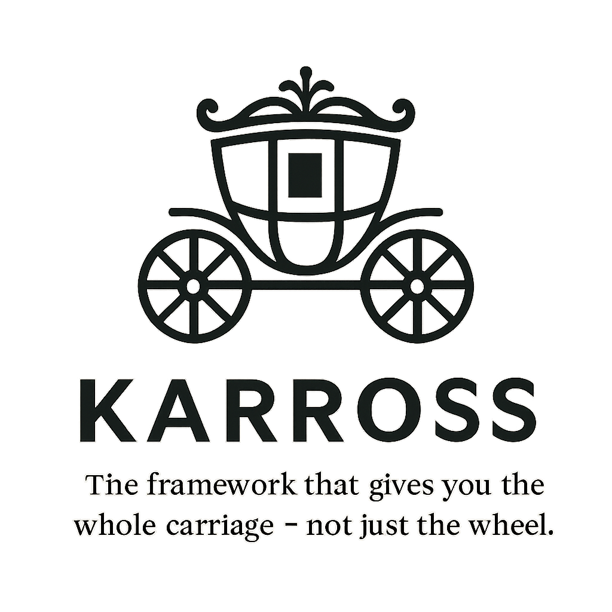

<p align="center">
  
</p>

## 1. Features

- Easily generate admin interfaces for your PHP entities

## 2. Installation

### Requirements

- PHP 8.4+
- Composer

```bash
composer require karross/KarrossBundle
```
## 3. Documentation

https://karross.github.io
