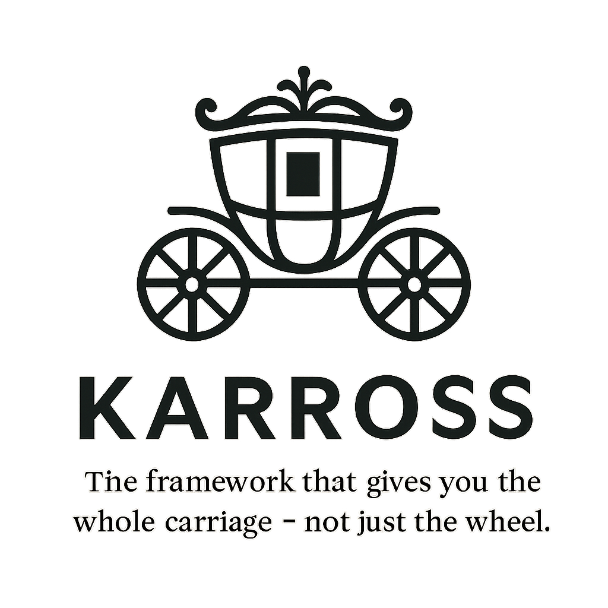

<p align="center">
  
</p>

## Requirements

- PHP 8.5+
- Composer
- Symfony 7.3+ with a Doctrine ORM configuration and mapped entities
- PHP extensions: `intl`, `bcmath`

## Installation

```bash
composer require karross/karross-bundle
```

## Documentation

https://karross.github.io